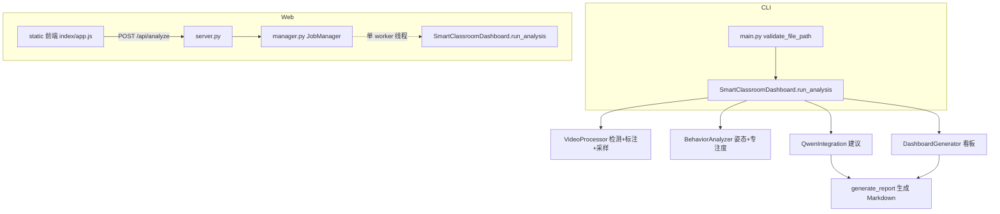

# 智慧课堂分析系统 — 代码分析文档

> 生成时间：2026-09-09
> 覆盖范围：核心分析管线（图片/视频）与 Web 前后端（FastAPI + 原生 JS 单页）

---

## 1. 项目概述

一个基于 **YOLO 姿态估计 + 千问(Qwen) 大模型** 的课堂专注度分析系统。用户上传一张课堂图片或一段课堂视频，系统自动完成：

1. 学生人形检测与跟踪（`yolo11s.pt`，ByteTrack）
2. 姿态关键点估计与**专注度打分**（`yolo11s-pose.pt`）
3. 生成六宫格可视化看板（matplotlib）
4. 调用千问生成教学改进建议
5. 输出 Markdown 报告

提供两条使用入口：

- **CLI**：`python main.py <图片/视频>`
- **Web**：`webapp/`（FastAPI 后台 + 原生 HTML/JS 单页，支持上传、进度轮询、历史记录）

---

## 2. 项目结构

```
smart_classroom_dashboard/
├── main.py                 # 入口 + 编排：SmartClassroomDashboard 主流程
├── video_processor.py      # 人形检测 + ByteTrack + 标注视频/图片输出
├── behavior_analyzer.py    # 姿态分析 + 专注度启发式打分
├── dashboard_generator.py  # 六宫格 matplotlib 看板生成
├── qwen_integration.py     # 千问(DashScope) 建议生成
├── media_utils.py          # 视频编码工具（mp4v → H.264 浏览器可播）
├── requirements.txt        # 依赖清单
├── .env / .env.example     # DashScope API Key 配置
├── data/                   # 测试样例（图片/视频）
├── output/                 # 输出：jobs/<id>/ 任务产物 + CLI 历史产物
├── webapp/                 # Web 后端
│   ├── server.py           #   FastAPI 路由 + 静态托管
│   ├── manager.py          #   JobManager：后台任务/历史/引擎懒加载
│   ├── __init__.py
│   └── static/             #   前端单页
│       ├── index.html
│       ├── style.css
│       └── app.js
└── yolo11*.pt              # YOLO 检测 / 姿态权重
```

---

## 3. 技术栈与依赖（`requirements.txt`）

| 依赖 | 用途 | 备注 |
|---|---|---|
| `ultralytics>=8.3.0` | YOLO 检测 / 姿态 / 跟踪 | 必须 ≥8.3 才支持 `yolo11*.pt` |
| `opencv-python>=4.9.0` | 视频读写、画框 | |
| `matplotlib>=3.7.2` | 看板绘图 | 中文需 CJK 字体 |
| `numpy>=1.26.0` | 数值计算 | |
| `dashscope>=1.14.1` | 千问 API | 无 Key 自动降级 |
| `python-dotenv>=1.0.0` | 读取 `.env` | |
| `fastapi / uvicorn / python-multipart` | Web 后端 | |
| `imageio-ffmpeg>=0.4.0` | 自带静态 ffmpeg | 视频 H.264 转码 |

> 注意：运行时需 `DASHSCOPE_API_KEY`（见 `.env`）。未配置时 AI 建议功能自动跳过并提示。

---

## 4. 系统架构



**两种入口共享同一核心分析引擎** `SmartClassroomDashboard`；Web 端通过 `JobManager` 把它放进单 worker 后台线程执行，避免 YOLO 推理非线程安全的问题，并支持任务排队与进度轮询。

---

## 5. 核心处理流程

### 5.1 总编排（`main.py::SmartClassroomDashboard.run_analysis`）

1. 校验扩展名（视频 `mp4/avi/mov/mkv`，图片 `jpg/jpeg/png/bmp`）
2. **目标检测阶段** → 映射进度 **5%–55%**
3. **行为分析阶段** → 映射进度 **56%–88%**
4. 生成看板（~90%）、AI 建议（~93%）、写报告（100%）
5. 返回 `(dashboard_path, report_path, analysis_results)`

`output_dir` 可传参实现任务隔离；`progress(pct, message)` 回调用于 Web 进度条。

### 5.2 视频处理（`video_processor.py::_process_video`）

- 逐帧 `YOLO.track(classes=[0], bytetrack, persist=True)` 做**人形检测 + 跟踪**
- 每帧用 `FrameAnnotator` 画框写标注视频
- 每 `fps/0.5`（约 2 秒）采样一帧（RGB）供后续姿态分析
- 人数估算：`min(去重轨迹数, max(每帧中位数, 每帧峰值))`（用帧级同时在座人数封顶 ByteTrack 因遮挡/跟丢拆分导致的轨迹虚高）
- 收尾调用 `media_utils.ensure_h264()` 把 mp4v 转成 **H.264**（浏览器可播放）

### 5.3 图片处理（`video_processor.py::_process_image`）

单帧检测 → 画框存 `annotated_image_*.jpg` → 返回单元素帧列表。

### 5.4 行为分析（`behavior_analyzer.py::analyze_frames`）

对采样帧跑姿态模型，将**人形检测框**与**姿态框**按 IoU(≥0.2) 优先、距离(<100px)兜底匹配；按姿态关键点计算专注度。

---

## 6. 专注度算法（启发式）

以 **90 分为基准**，根据姿态关键点做规则扣分，最终夹在 [0,100]：

| 行为特征 | 判定方式 | 扣分 |
|---|---|---|
| 低头 | 鼻尖低于双耳中点超过阈值 | -25 |
| 转头 | 双耳高度差明显且不对称 | -15 |
| 双眼缺失 | 眼关键点不可见 | -20（单眼 -10） |
| 侧身 | 双肩高度差 + 肩距狭窄 | -15 |
| 关键点过少 | 有效关键点 <3 | 每个 -10 |
| 鼻子缺失 | 鼻不可见 | -15 |

**无姿态兜底**：当人形框匹配不到姿态（远/遮挡/背对）时，用位置+框大小+置信度估计，**上限封顶 65**——此类学生几乎不会被判为"专注"。

**专注判定阈值**：`attention_score > 60` 记为专注。

---

## 7. 看板生成（`dashboard_generator.py`）

2×3 六宫格 PNG，dpi=150：

1. 课堂概览（人次 / 平均专注度）
2. 专注度分布直方图
3. 专注度时间趋势（散点 + 滑动平均 + 五段均值；图片模式提示"无数据"）
4. 学生位置分布散点图
5. 专注/不专注饼图
6. 关键指标文本

启动时自动从候选列表选择可用**中文字体**（微软雅黑/苹方/Noto Sans CJK 等），避免非 Windows 环境中文变方块。

---

## 8. 千问集成（`qwen_integration.py`）

- 初始化时读取 `DASHSCOPE_API_KEY`，缺失则 `enabled=False` 优雅降级
- 把聚合指标 + 时间趋势切 5 段均值拼接为 prompt，调 `qwen-max`
- 输出文本写入报告的"智能分析建议"章节
- 异常时返回错误文案，不中断主流程

---

## 9. Web 端设计（`webapp/`）

### 9.1 后端

**`server.py`** — FastAPI 应用：

| 方法/路径 | 说明 |
|---|---|
| `GET /` | 返回前端单页 |
| `POST /api/analyze` | 上传图片/视频（multipart），立即返回 job，后台异步 |
| `GET /api/jobs` | 历史任务列表 |
| `GET /api/jobs/{id}` | 单任务状态/进度/结果 |
| `GET /api/jobs/{id}/report` | 报告纯文本 |
| `GET /outputs/...` | 产物静态托管（看板/报告/标注媒体） |

**`manager.py` — `JobManager`** 关键设计：

- **单 worker 线程池**顺序执行任务（YOLO 非线程安全），长任务自动排队
- **分析引擎懒加载**：首次任务才加载 YOLO 模型，加快服务启动
- 每个任务独立目录 `output/jobs/<id>/`：`source.*`、`dashboard_*.png`、`report_*.md`、`annotated_*`
- 历史持久化到 `output/jobs/_history.json`，重启可恢复
- `repair_legacy_videos()`：启动时把历史遗留的 mp4v 标注视频自动转码为 H.264
- summary 只保留轻量指标（剔除 `detailed_data` 大对象）

### 9.2 前端（原生 HTML/JS，无构建）

- **上传**：点击/拖拽，客户端校验格式并显示文件信息
- **进度**：900ms 轮询 `GET /api/jobs/{id}`，进度条 + 阶段文案 + 状态徽章
- **结果**：指标卡片（人数/人次/专注度等）、标注媒体播放器、看板图、报告文本、下载/查看链接
- **历史**：侧栏列表（状态徽章 + 指标预览），点击可回看任意任务

---

## 10. 运行与使用

### CLI

```bash
python main.py data/test1.mp4     # 视频
python main.py data/test3.jpg     # 图片
```

### Web（注意：当前环境 `python` 命令不可用，须用全路径）

```powershell
cd d:\code\smart_classroom_dashboard
& "D:\developTools\miniconda3\python.exe" -m webapp.server
# 打开 http://127.0.0.1:8000
```

> 全依赖解释器为 conda base：`D:\developTools\miniconda3\python.exe`（含 fastapi/uvicorn/multipart/imageio-ffmpeg）。

---

## 11. 已知问题与改进建议

### 识别/分析精度
- **无姿态兜底分封顶 65**：背对/遮挡/远处学生几乎不可能 >60，会系统性拉低平均专注度 → 建议引入"无法判定"状态，或调整兜底与专注阈值逻辑
- **两套跟踪 ID 相互独立**：人形检测与姿态分析各自跑 ByteTrack 再靠 IoU 二次匹配，拥挤/遮挡时易错配 → 建议共用一份跟踪结果
- **推理参数未做场景优化**：当前 `yolo11s@640、conf=0.25`，对"广角教室、学生小、密集"场景可考虑 `imgsz=1280`、更大模型（yolo11m/l）或微调
- 视频逐帧全量检测较慢、内存保留全部采样帧，长视频开销大

### 工程/健壮性
- 历史/产物无清理与删除接口，长期运行会累积磁盘占用
- 任务级无鉴权、上传大小无限制，若需部署到公网需补安全措施
- 千问调用阻塞在 worker 线程内，无超时熔断（网络异常仅靠异常兜底）

### 前端体验
- 报告以纯文本 `<pre>` 展示，未渲染 Markdown 富文本
- 视频播放器为浏览器默认控件（可加全屏/倍速/进度记忆）

---

## 12. 变更记录（本会话已做优化/修复）

| 类别 | 内容 |
|---|---|
| 依赖 | `ultralytics` 升到 ≥8.3（支持 YOLO11）；追加 FastAPI / uvicorn / multipart / imageio-ffmpeg |
| 报告 | Markdown 内看板图片改引用 basename，修复 `output/output/...` 坏链 |
| 人数估算 | 去掉整体 ÷2 的低估逻辑，改用"轨迹数与帧级人数取交集"，并统一人数口径 |
| 健壮性 | `total_frames==0` 除零防护；移除未用的 `results[0].plot()`；去除多余 `import math` |
| 字体 | 看板中文字体跨平台自动回退 |
| 进度 | 为视频/行为阶段加入进度回调钩子 |
| Web | 新增 FastAPI 后台 + 原生 JS 单页：上传、进度轮询、结果展示、历史记录 |
| 任务隔离 | `run_analysis` 支持按任务输出目录，产物按 `output/jobs/<id>/` 归档 |
| 视频播放 | 修复 OpenCV `mp4v` 无法被浏览器解码的问题：`media_utils.ensure_h264()` 统一转 H.264，历史视频启动时自动修复 |
| Bug 修复 | 修复 `_process_video` 结尾 `estimated_students` 未定义（编辑残留）导致的视频链路 NameError |

# 13.打开网页

## 1️⃣ 如果服务还在运行（推荐先试这个）

直接在**浏览器**（Edge/Chrome 等）地址栏输入：

- http://127.0.0.1:8000

  ​

然后按回车，就能看到「智慧课堂分析系统」页面了。

> `127.0.0.1` 就是"本机"的意思，网页只在你这台电脑上访问。

## 2️⃣ 如果打不开 / 显示"无法访问"，说明服务没在运行

需要先启动服务，**并且启动后别关掉那个黑色终端窗口**。操作步骤：

1. 打开 **VS Code 的终端**（顶部菜单：终端 → 新建终端）
2. 输入下面这行命令后按回车：

- cd d:\code\smart_classroom_dashboard; & "D:\developTools\miniconda3\python.exe" -m webapp.server

  ​

1. 看到 `Uvicorn running on http://0.0.0.0:8000` 就表示启动成功
2. 再去浏览器打开 `http://127.0.0.1:8000`

## 3️⃣ 停止服务

在那个运行服务的终端里按 **Ctrl + C** 即可关闭。

------

页面打开后怎么用：

- 中间「开始分析」区域**点击或拖拽**上传图片/视频 → 点「**开始分析**」
- 会自动显示处理进度，完成后在下方看到**指标、标注视频、看板图、AI 报告**
- 右侧「**历史分析**」可以回看之前所有任务