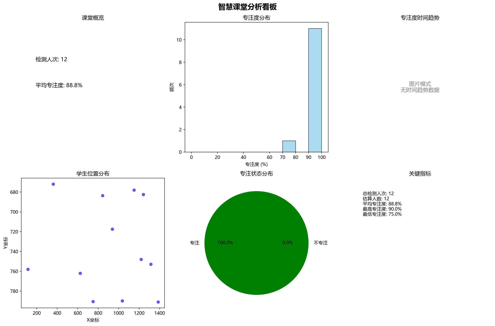

# 智慧课堂分析报告

生成时间：2026-09-14 17:47:16

## 课堂概览
- **估算学生人数**：12 人
- **检测总人次**：12 人次
- **平均专注度**：88.75%

## 分析看板

## 智能分析建议
基于提供的数据，我们可以看出课堂整体上学生的专注度较高，但存在初期专注度相对较低的情况。以下是从四个角度出发的具体改进建议：

### 1. 教学方法优化
- **调整教学节奏**：根据时间趋势分析可以看出，在课程开始阶段（时段1）学生的平均专注度为82.5%，明显低于其他时段的90%。这可能表明学生在课程初期需要更多的时间来适应学习环境或内容。建议适当放慢这一阶段的教学速度，增加互动环节以帮助学生更快进入状态。
- **引入多样化的教学手段**：考虑到后期专注度保持在一个较高的水平，可以考虑在课程初期采用更多样化的教学方法，比如小组讨论、案例研究等，来提高学生的参与感和兴趣。

### 2. 课堂管理
- **及时干预策略**：对于专注度处于低谷期的第一时段，教师可以通过提问、小测验等方式增强与学生的互动，及时捕捉并解决学生理解上的困难点。
- **营造积极的学习氛围**：鼓励学生之间相互支持和合作，通过正面反馈机制激发学生的学习动力，尤其是在发现某些同学注意力不集中时给予适当的提醒和支持。

### 3. 学生互动
- **个性化关注**：针对那些在第一时段专注度较低的学生，老师可以在课后进行个别交流，了解他们遇到的问题，并提供针对性的帮助。
- **促进同伴学习**：建立学习小组，让成绩较好且乐于助人的学生带领小组成员共同进步，特别是帮助那些容易分心的同学更好地融入课堂活动当中。

### 4. 教学内容
- **内容结构优化**：如果发现某个特定知识点或环节导致了学生专注度下降，则需对该部分内容进行重新设计或简化，确保其易于理解和吸收。
- **增加实践机会**：将理论知识与实际操作相结合，通过实验、项目等形式让学生亲身体验所学知识的应用场景，从而加深理解和记忆。
- **适时复习巩固**：定期安排回顾之前学习过的材料，帮助学生巩固记忆，同时也能及时发现并解决遗留问题。

综上所述，通过对教学方法、课堂管理、学生互动以及教学内容等方面的综合考量与调整，有望进一步提升课堂教学效果，实现更高效的知识传递。

